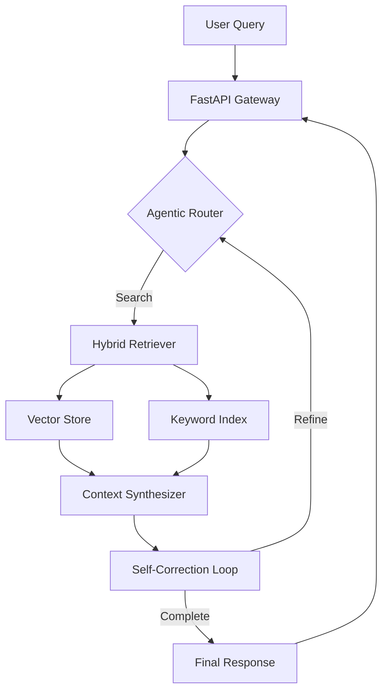

# Quantum Nexus: Agentic MLOps Framework

[](https://www.python.org/downloads/)
[](https://fastapi.tiangolo.com)
[](https://opensource.org/licenses/MIT)
[](#)

**Quantum Nexus** is an enterprise-grade, agentic RAG (Retrieval-Augmented Generation) and MLOps framework designed for building self-correcting AI pipelines. It combines hybrid search, agentic reasoning, and production-level observability.

## 🚀 Key Features

- **Agentic RAG:** Self-correcting query loops that refine search results based on context relevance.
- **Hybrid Search:** Combines Vector Embeddings (ChromaDB/Pinecone) with BM25 Keyword Search.
- **MLOps Integration:** Experiment tracking with MLflow and automated CI/CD via GitHub Actions.
- **Production API:** High-performance FastAPI backend with Pydantic v2 validation and JWT security.
- **Observability:** Prometheus-compatible metrics and structured JSON logging.

## 🏗️ Architecture



## 🛠️ Tech Stack

- **Frameworks:** FastAPI, LangChain, Pydantic v2.
- **AI Models:** OpenAI/Anthropic/Ollama (Customizable).
- **Data:** ChromaDB, SQLite (Metadata).
- **DevOps:** Docker, GitHub Actions, MLflow.

## 📥 Getting Started

### Prerequisites
- Python 3.10+
- Docker & Docker Compose

### Installation
1. Clone the repository:
   ```bash
   git clone https://github.com/your-username/Quantum-Nexus-Agentic-MLOps.git
   cd Quantum-Nexus-Agentic-MLOps
   ```

2. Setup environment:
   ```bash
   cp .env.example .env
   pip install -r requirements.txt
   ```

3. Run with Docker:
   ```bash
   docker-compose up --build
   ```

## 🧪 Testing
```bash
pytest tests/
```

## 📜 License
This project is licensed under the MIT License - see the [LICENSE](LICENSE) file for details.
